# NOKIA EA0326GMP + OpenClash 教程


> 声明：本仓库仅用于个人学习研究，请勿将资料用于商业用途。


## 前置准备

- 准备一台电脑，并安装好 `git`
- 把本仓库克隆到本地，`git clone https://github.com/easy-programming-guide/NOKIA-EA0326GMP.git`
- 一根网线
- 一台 NOKIA EA0326GMP 路由器
- NOKIA EA0326GMP 已经刷好 uboot 固件，并且已经安装好 `ssh` 服务，关于这一步请移步恩山论坛或者其他大神，这里就不再赘述了。


## 本教程提供的和步骤最后一次验证的日期是 2024-07-18 


## 教程步骤


### 第一步：刷入固件，修改默认 LAN 口 IP

1. 使用 uboot 把当前源码当中 `immortalwrt-mediatek-mt7981-nokia_ea0326gmp-squashfs-factory.bin` 刷入路由器
2. 等待重启之后，用网线连接你的电脑和路由器
3. 打开路由器管理界面`192.168.1.1`，账号是 `root`，密码是 `password`
4. 因为现在很多家庭的光猫默认 IP 也是 `192.168.1.1`，所以我们需要把 NOKIA EA0326GMP 的 IP 改成 `192.168.2.1`，如下图所示：
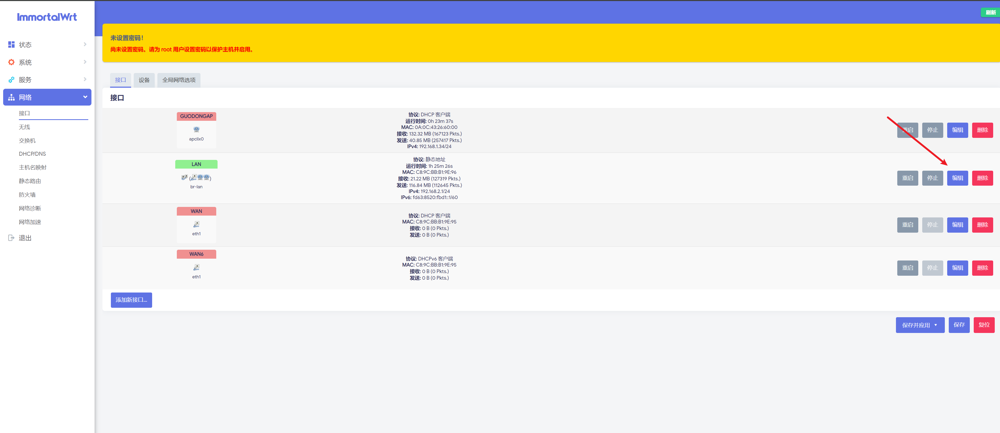
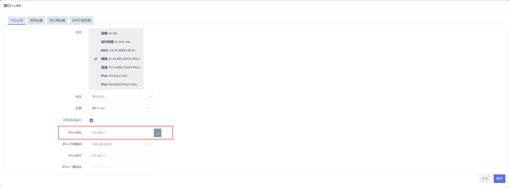

> 这里很重要，如果你的光猫跟你的 NOKIA EA0326GMP 局域网 IP 冲突了，后续连接互联网的时候会出问题，所以一定要把 NOKIA EA0326GMP 的 IP 改成 跟光猫的 IP 段不一样的，例如 `192.168.X.1`， X 不等于光猫的值即可。


### 第二步：修改默认的软件源

原文地址：https://help.mirrors.cernet.edu.cn/immortalwrt/

将源改写为如下内容

```conf
src/gz immortalwrt_base https://mirrors.cernet.edu.cn/immortalwrt/releases/21.02-SNAPSHOT/packages/aarch64_cortex-a53/base
src/gz immortalwrt_helloworld https://mirrors.cernet.edu.cn/immortalwrt/releases/21.02-SNAPSHOT/packages/aarch64_cortex-a53/helloworld
src/gz immortalwrt_kenzo https://mirrors.cernet.edu.cn/immortalwrt/releases/21.02-SNAPSHOT/packages/aarch64_cortex-a53/kenzo
src/gz immortalwrt_luci https://mirrors.cernet.edu.cn/immortalwrt/releases/21.02-SNAPSHOT/packages/aarch64_cortex-a53/luci
src/gz immortalwrt_packages https://mirrors.cernet.edu.cn/immortalwrt/releases/21.02-SNAPSHOT/packages/aarch64_cortex-a53/packages
src/gz immortalwrt_passwall https://mirrors.cernet.edu.cn/immortalwrt/releases/21.02-SNAPSHOT/packages/aarch64_cortex-a53/passwall
src/gz immortalwrt_routing https://mirrors.cernet.edu.cn/immortalwrt/releases/21.02-SNAPSHOT/packages/aarch64_cortex-a53/routing
src/gz immortalwrt_telephony https://mirrors.cernet.edu.cn/immortalwrt/releases/21.02-SNAPSHOT/packages/aarch64_cortex-a53/telephony
```

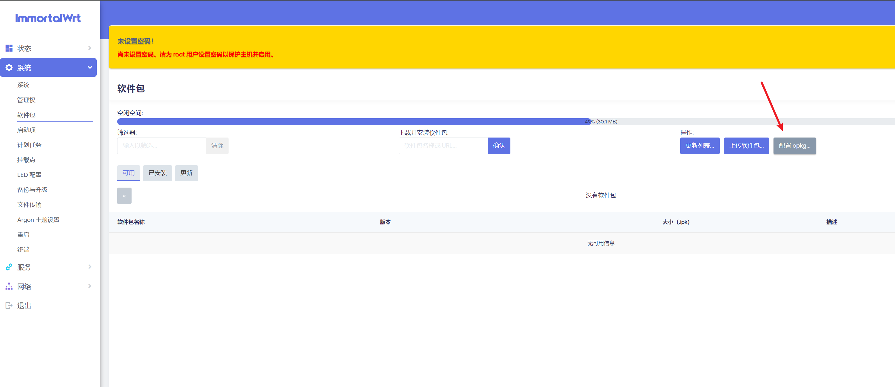
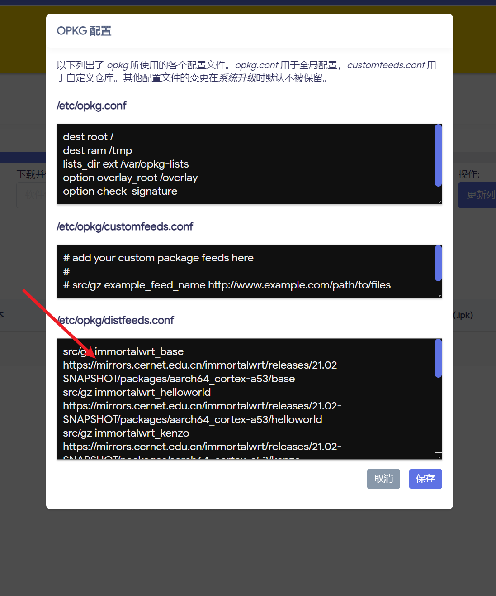

### 第三步：让 NOKIA EA0326GMP 连上互联网

你可以有如下的几种方式让 NOKIA EA0326GMP 上网：


#### NOKIA EA0326GMP 有线连接光猫的上网方式

1. 默认的路由模式，把 NOKIA EA0326GMP 设置为主路由，光猫的 LAN 口对接 NOKIA EA0326GMP 的 WAN 口，光猫一定要改成桥接模式，联系宽带师傅或者打电话给运营商，让 NOKIA EA0326GMP 进行宽带拨号上网（这是主流使用的模式）
2. 如果 1 行不通，现在很多地区的运营商不允许客户修改光猫，或者说有一些特殊的利益纠缠，就不给你改桥接， 那就把 NOKIA EA0326GMP 设置为副路由，也就是相对于光猫来说的下一级的网关，这个时候也是需要把光猫的 LAN 口对接 NOKIA EA0326GMP 的 WAN 口，回到路由器后台设置为 `DHCP 客户端`，如下图
    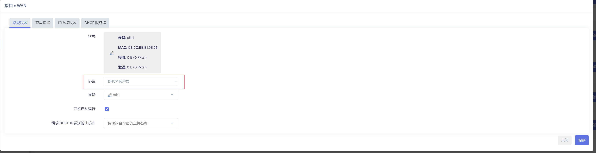
3. 或者你想自己手动设置 IP，那就在路由器后台设置 `静态 IP`，如下图，必须要跟光猫的 LAN 口 IP 段一致，否则无法上网。


### NOKIA EA0326GMP 无法有线连接光猫的上网方式

有些情况下，不方便把 NOKIA EA0326GMP 跟光猫放在一起，例如光猫本身就很大，最近几年，运营商分纷纷定制了各种综合各种功能的光猫，还带 wifi 的，有些 wifi 的天线都好几根，弱电箱根本放不进去，再来一个 NOKIA EA0326GMP 想放进弱电箱也不现实，另外还有一些装修的时候没有考虑到埋线或者是入墙的网口，这个时候就需要用到路由器的无线组网功能了。

首先，你需要光猫自带 WIFI，如果光猫不带 WIFI，你又想 NOKIA EA0326GMP 无线连接光猫，确定不是痴人说梦？那么我建议你更换你家里的光猫，跟运营商联系，一般每隔2年运营商就会借升级宽带的接口把你的宽带费用提高，并且扬言会给你更换新一代的光猫，这个时候你就要抓住机会薅羊毛，如果无法解决光猫自带 WIFI 的问题，那么无线组网梦想就破灭了。

最后，如果你光猫没有 wifi，你可以考虑再买一个小的 wifi 路由器，让它用有线接光猫，然后让它开 AP 模式，成为 wifi 热点，，只要能支持 5gz 频段的就能用，而且现在这种 mini 路由器性价比很高。

这里要严正谴责一下中兴系列的路由器，全系列全家都不支持 AP 模式，电信装宽带送的路由器，都支持 AP，我真的是无力吐槽。

#### 无线中继或者无线桥接 - 会损失一半的带宽，如果二次中继则会继续叠加损失一半的带宽

此处要明确你的需求，因为无线中继和无线桥接是两个不同的概念，

假设你的主路由 IP 是 `192.168.1.1` 并且开启了 DHCP

差异如下：

| 异同 | 无线中继 | 无线桥接 |
| --- | --- | --- |
| 与主路由的理论连接方式| 主路由 Lan 口 <---> 副路由的 LAN | 主路由的 LAN <---> 副路由的 WAN 口 |
| 副路由器自身的 WAN 口 IP | 无，无线中继不启用副路由的 WAN | 主路由会主动 DHCP 给副路由的 WAN 口分配 IP，或者手动设置跟主路由器同一网段，例如 192.168.1.2 |
| 副路由器自身的 LAN 口 IP | 主路由 DHCP 主动分配给副路由的 LAN 口分配 IP，或者手动设置跟主路由器同一网段，例如 192.168.1.2  | 副路由自身 LAN 口的 IP，例如 192.168.2.1，千万要确保这个 IP 跟主路由不是同一网段 |
| 副路由器自身DHCP | 要主动关闭副路由的 DHCP | 开启副路由的 DHCP |
| 副路由器自身网关和 DNS| 在副路由的 LAN 口上可以查询到当前 DNS 和网关是主路由的 IP 192.168.1.1 | 在副路由的 WAN 口上可以查询到当前 DNS 和网关是主路由的 IP 192.168.1.1|
| 手机电脑客户端 DNS 和网关  |在电脑上执行 ipconfig 可以查询到网关是主路由的 IP 192.168.1.1| 在电脑上执行 ipconfig 可以查询到网关是副路由的 IP 192.168.2.1 |
| 手机电脑客户端 IP | 主路由网段 DHCP 分配的 IP，例如 192.168.1.120 | 副路由网段 DHCP 分配的 IP，例如 192.168.2.189 |

所以根据上面的逻辑分析，网上有各种名词

- WISP： 相当于路由器的WAN口接上级路由器的LAN口。路由器的DHCP不用关闭，网段跟上级不同。本路由器所接设备与上级IP网段不同。**这就是无线桥接**
- AP： AP(接入点)模式下，只需要把一根可以上网的网线插在路由器上，无需任何配置就可以通过有线和无线上网了；在此模式下，该设备相当于一台无线HUB，可实现无线之间、无线到有线、无线到广域网络的访问。说到底就相当于一台拥有无线功能的交换机。**这就是无线中继**
- Repeater（中继）模式：Repeater（中继）模式下，路由器会通过无线的方式与一台可以上网的无线路由器建立连接，用来放大可以上网的无线路由器上的无线信号，注意：放大后的无线信号的名称和原来的无线路由器的无线信号名称一致。**这就是无线中继**
- Bridge（桥接）模式： Bridge（桥接）模式，路由器会通过无线的方式与一台可以上网的无线路由器建立连接，用来放大可以上网的无线路由器上的无线信号；注意：放大后的无线信号的名称和原来的无线路由器的无线信号名称不一样。**这就是无线桥接**


另外关于 WIFI 名称：

- 副路由的 WIFI 名称均可以与主路由 WIFI 名称保持一致，也可以不同，如果不同，就无法漫游。关于漫游，还需要强调，无线桥接下的漫游实际上是两个网络之间的切换，因为你连接到副路由的时候，你已经切换了你的子网，在默认不手动修改的情况下，你的 DNS 和网关都会被重新设定为这台副路由器的 IP，其实就是相当于跳槽去另一个网络了，而无线中继在漫游的时候，手机的 IP 和 DNS 不会变。

关于带宽损耗：

- 均会损失一半的带宽，因为无线信号需要同时承担连接主路由和客户端手机/电脑的通信。

1. 有线连接 - 不管是主路由 LAN 口连接副路由的 LAN 还是 WAN

- 工作原理：在有线桥接中，两个路由器通过网线（例如以太网线）直接相连。每根网线通常有自己的带宽，例如100 Mbps、1 Gbps或更高。

- 带宽利用：在这种情况下，数据在两个路由器之间通过网线传输。网线提供了一个专用的通信通道，没有其他设备会在这个通道上竞争带宽，因此不会有带宽的显著损失。两个路由器可以充分利用网线的最大带宽。

2. 无线连接 - 包括无线中继和无线桥接

- 工作原理：在无线桥接中，两个路由器通过无线信号（例如Wi-Fi）相连。无线桥接通常需要一个路由器工作在“客户端模式”或“桥接模式”，它会连接到另一个路由器。

- 带宽利用：无线桥接的带宽损失主要来自以下几个原因：

- 信道共享：在无线桥接中，两个路由器必须使用相同的无线信道进行通信。如果这个信道上有其他设备，也会占用带宽，导致可用带宽减少。

- 双工通信：Wi-Fi本质上是半双工通信，这意味着同一时间内只能进行单方向的数据传输（要么发送，要么接收）。在无线桥接中，数据需要在两个路由器之间双向传输，因此会产生更多的等待时间和信道竞争，导致带宽减半。

- 中继效应：无线桥接通常需要一个路由器接收到数据后再发送给下一个设备。这种中继操作需要两次传输，第一次从主路由器到桥接路由器，第二次从桥接路由器到客户端设备，这也会导致有效带宽减半。

总结：有线连接提供了一个专用和独占的通信通道，因此不会损失带宽；而无线连接由于信道共享、半双工通信以及中继效应，导致了带宽的损失，通常是50%。

根据如上理论，针对不同的需求，你需要了解接下来的操作步骤实现的是

## 无线桥接 - 我把 NOKIA EA0326GMP 当作第二级子局域网，连接到这个路由器的客户端 IP 与主路由不在同一个网段

我的需求如下：

- 这台路由器是我工作路由器，工作需要需要科学上网
- 主路由器是光猫，光猫自带不错的的 5G 和 2.4G WIFI
- 我不想把带有科学上网功能的路由器当作主路由器，因为主路由器的 2.4G WiFi 被很多智能家电，智能开关，监控摄像头连着，他们没必要科学上网
- 我不希望我折腾路由器的时候，比如路由器要断网，重刷固件，就把全家的主路由器都搞断网
- 我也不希望我在这个子局域网内部署的小型服务被主路由器网段的设备扫描出来，比如很多智能应用会扫描局域网内的常用端口来提供局域网分享服务，因此我想屏蔽掉来自主路由器网段的扫描
- 这台路由器我下班就可以关闭，无需 24 小时不间断的运行

具体操作如下：

先让 NOKIA EA0326GMP 扫描附近的 wifi

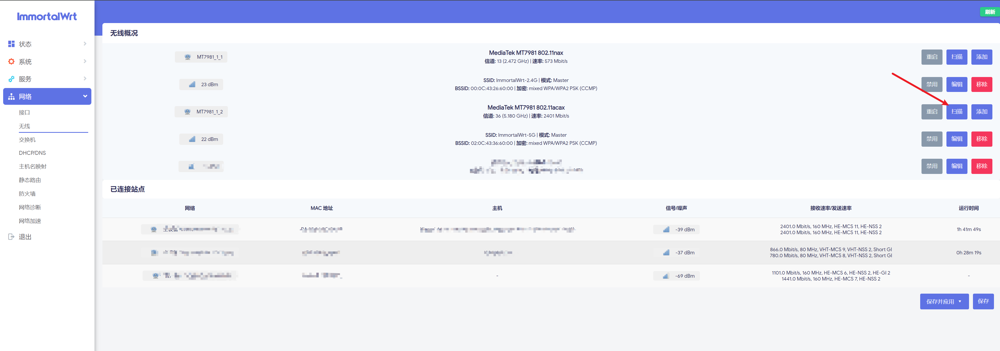

然后选择一个你上游的热点（光猫的 WIFI 5G 或者是你主路由器/上级路由器的 5G WIFI），如下图：

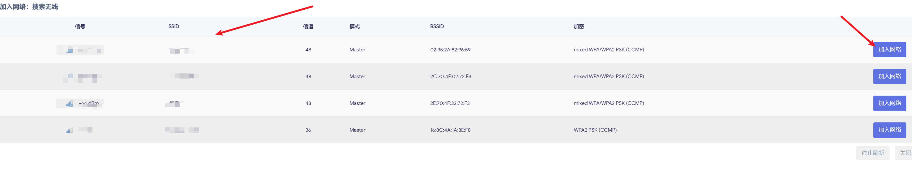

点击 `加入网络` ，紧接着要输入如下信息

- 新网络的名称： 这个是你 NOKIA EA0326GMP 用于管理的网络名称，随便取一个，你能认识就行
- WPA 密钥： 输入你上游的热点（光猫的 WIFI 5G 或者是你主路由器/上级路由器的 5G WIFI 的密码之后
- 点击提交即可，如下图：

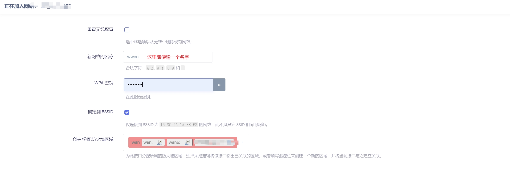

然后就是漫长的等待，NOKIA EA0326GMP 需要很长时间才能把无线中继能做好，请记住，前面说的

> 这里很重要，如果你的光猫跟你的 NOKIA EA0326GMP 局域网 IP 冲突了，后续连接互联网的时候会出问题，所以一定要把 NOKIA EA0326GMP 的 IP 改成 跟光猫的 IP 段不一样的，例如 `192.168.X.1`， X 不等于光猫的值即可。

这般操作之后

- NOKIA EA0326GMP 的 IP 是 `192.168.2.1`
- 你的光猫是 IP 是 `192.168.1.1`
- 你这台电脑此刻的网关是 NOKIA EA0326GMP 的 IP， 也就是 `192.168.2.1`

这样操作之后，需要等待你电脑能够正常上网，如果不能上网，一定是你的网段设置有误，或者说上游的热点（光猫的 WIFI 5G 或者是你主路由器/上级路由器的 5G WIFI）无法上网。


#### 为什么说无线中继会损失一半的带宽？就这样我还会推荐这种方式呢？

请看路由器信息显示 
- 信道: 36 (5.180 GHz) | 速率: 2401 Mbit/s

在 5G 频段，2401 Mbit/s 是总共的带宽，我必须用一半的带宽连接上游热点，那么我剩下的一半就可以共给我手机/电脑/iPad去使用了，做一个算术题 2401 Mbit/s 除以 2，就是 1200 Mbit/s，也就是 5G 频段下，我单台终端设备（手机/电脑/iPad）可以同时使用 1200 Mbit/s 的带宽，完全够用了，因为你家光猫目前也未必能打满千兆。

### 无线 Mesh 组网 - 这个等我买了第二台 NOKIA EA0326GMP 我一定会测试一下，据可靠卖家说，是可以的，但是我没试过。

搞定了外网连接，之后继续下一步重点，安装 openclash 。

### 第四步：安装 OpenClash

> 注：如果你有需求可以自行安装 openclash 最新版本 https://github.com/vernesong/OpenClash/releases

上传本文提供的 ipk 文件，不出意外应该能安装成功，这里需要注意，这个固件安装成功之后不会立刻出现在左侧的服务栏下面，建议你直接重启路由器，然后重新登录，到服务栏里面找一下。

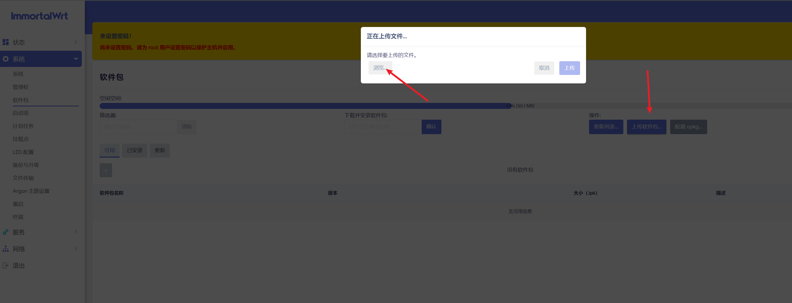

### 第五步：调整和配置 openclash 

导入你自己的订阅或者你自己手写的配置文件，配好代理，尝试启动，

这里会有一个问题，openclash 在第一次启动的时候实际上是去重新下载几个内核文件，但是这些内核文件在 GitHub 上，很容易因为某些众所周知的原因无法下载，这个时候你注意查看安装日志，会发现如下错误：

> 最新版本日志出现：【/tmp/openclash_last_version】下载失败 【curl: (60) SSL certificate problem: self signed certificate More details here: https://curl.haxx.se/docs/sslcerts.html  curl failed to verify the legitimacy of the server and therefore could not establish a secure connection to it. To learn more about this situation and how to fix it, please visit the web page mentioned above

此时你只需要去修改 Github cdn 即可，如下图：

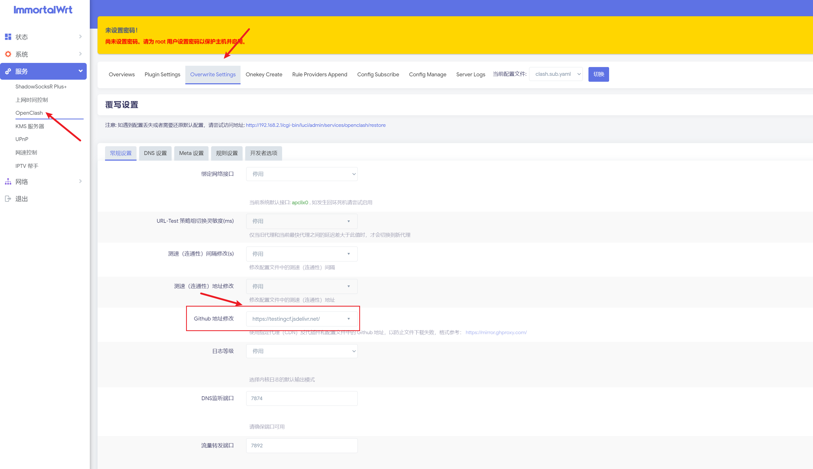

### 第六步：配置 openclash 

重新刷新订阅/或者尝试手动启动，完全按照以上步骤就可以完美启动。

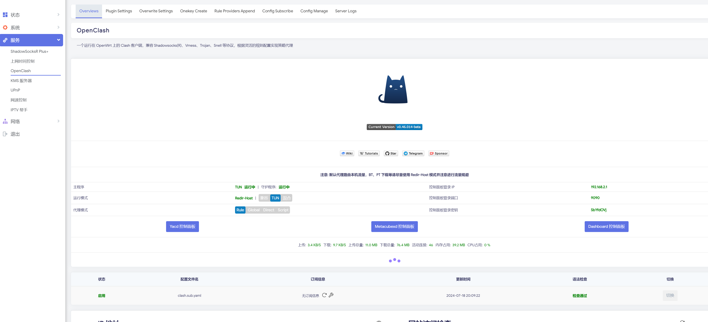


## 常见问题

1. 我想实现子路由 NOKIA EA0326GMP 和主路由的无线漫游，不想使用文中提及的无线桥接模式，而是使用无线中继并且 WIFI 名称与主路由一致，那么我该如何操作？

    操作如下
    - 断开主路由和 NOKIA EA0326GMP 之间的桥接连接
    - 修改 NOKIA EA0326GMP 的 LAN 口 IP 为 `192.168.1.2`
    - 网关设置为 `192.168.1.1`
    - 要关闭此 LAN 口上的 DHCP 功能

    然后把 NOKIA EA0326GMP 拿到主路由器附近，用有线连接 NOKIA EA0326GMP 的 LAN 口和主路由的 LAN 口，再用有线连接 NOKIA EA0326GMP 的 LAN 口和电脑，确认有线的方式可以让电脑有如下行为

    - 电脑可以正常上网
    - 电脑的 IP 是 `192.168.1.X`，X 是主路由分配 DHC 分配的 IP
    - 电脑的网关是 `192.168.1.1`
    - 电脑的 DNS 是 `192.168.1.1`

    然后断开有线，尝试用前面的方法重新扫描+加入网络，先尝试不要把名字改成跟主路由一致，然后让电脑连接 NOKIA EA0326GMP 的 WIFI，确保

    - 电脑可以正常上网
    - 电脑的 IP 是 `192.168.1.X`，X 是主路由分配 DHC 分配的 IP
    - 电脑的网关是 `192.168.1.1`
    - 电脑的 DNS 是 `192.168.1.1`

    然后尝试把 NOKIA EA0326GMP 的 WIFI 名称改成跟主路由一致，然后再用有线连接 NOKIA EA0326GMP 的 LAN 口和电脑，确认这种情况下

    - 电脑可以正常上网
    - 电脑的 IP 是 `192.168.1.X`，X 是主路由分配 DHC 分配的 IP
    - 电脑的网关是 `192.168.1.1`
    - 电脑的 DNS 是 `192.168.1.1`

    最后就是电脑连接 WIFi，注意此时，很难确保你 WIFI 一定是连着 NOKIA EA0326GMP 因为两个路由的 WIFI 名字统一，你可以尝试把 NOKIA EA0326GMP 拿的远一点，然后拿着手机再离它远一点，例如

    主路由器 <------------------------------> NOKIA EA0326GMP 副路由器 <-----------------------------------------------------------> 你拿着手机

    保证你离主路由器很远很远，然后手机连接 WIFI ，看下 IP 和 网关以及 DNS