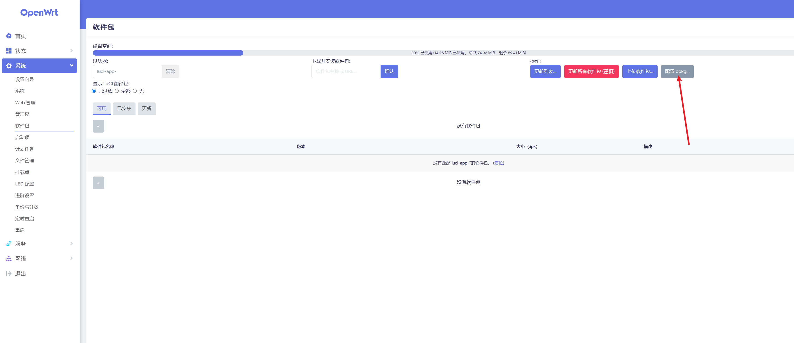

# NOKIA EA0326GMP + OpenClash 教程


> 声明：本仓库仅用于个人学习研究，请勿将资料用于商业用途。


## 前置准备

- 准备一台电脑，并安装好 `git`
- 把本仓库克隆到本地，`git clone https://github.com/easy-programming-guide/NOKIA-EA0326GMP.git`
- 一根网线
- 一台 NOKIA EA0326GMP 路由器
- NOKIA EA0326GMP 已经刷好 uboot 固件，并且已经安装好 `ssh` 服务，关于这一步请移步恩山论坛或者其他大神，这里就不再赘述了。


## 本教程提供的和步骤最后一次验证的日期是 2024-07-18 


## 教程步骤


### 第一步：刷入固件，修改默认 LAN 口 IP

1. 使用 uboot 把当前源码当中 `immortalwrt-mediatek-mt7981-nokia_ea0326gmp-squashfs-factory.bin` 刷入路由器
2. 等待重启之后，用网线连接你的电脑和路由器
3. 打开路由器管理界面`192.168.1.1`，账号是 `root`，密码是 `password`
4. 因为现在很多家庭的光猫默认 IP 也是 `192.168.1.1`，所以我们需要把 NOKIA EA0326GMP 的 IP 改成 `192.168.2.1`，如下图所示：


> 这里很重要，如果你的光猫跟你的 NOKIA EA0326GMP 局域网 IP 冲突了，后续连接互联网的时候会出问题，所以一定要把 NOKIA EA0326GMP 的 IP 改成 跟光猫的 IP 段不一样的，例如 `192.168.X.1`， X 不等于光猫的值即可。


### 第二步：修改默认的软件源

原文地址：https://help.mirrors.cernet.edu.cn/immortalwrt/

将源改写为如下内容

```conf
src/gz immortalwrt_base https://mirrors.cernet.edu.cn/immortalwrt/releases/21.02-SNAPSHOT/packages/aarch64_cortex-a53/base
src/gz immortalwrt_helloworld https://mirrors.cernet.edu.cn/immortalwrt/releases/21.02-SNAPSHOT/packages/aarch64_cortex-a53/helloworld
src/gz immortalwrt_kenzo https://mirrors.cernet.edu.cn/immortalwrt/releases/21.02-SNAPSHOT/packages/aarch64_cortex-a53/kenzo
src/gz immortalwrt_luci https://mirrors.cernet.edu.cn/immortalwrt/releases/21.02-SNAPSHOT/packages/aarch64_cortex-a53/luci
src/gz immortalwrt_packages https://mirrors.cernet.edu.cn/immortalwrt/releases/21.02-SNAPSHOT/packages/aarch64_cortex-a53/packages
src/gz immortalwrt_passwall https://mirrors.cernet.edu.cn/immortalwrt/releases/21.02-SNAPSHOT/packages/aarch64_cortex-a53/passwall
src/gz immortalwrt_routing https://mirrors.cernet.edu.cn/immortalwrt/releases/21.02-SNAPSHOT/packages/aarch64_cortex-a53/routing
src/gz immortalwrt_telephony https://mirrors.cernet.edu.cn/immortalwrt/releases/21.02-SNAPSHOT/packages/aarch64_cortex-a53/telephony
```




### 第三步：让 NOKIA EA0326GMP 连上互联网

你可以有如下的几种方式让 NOKIA EA0326GMP 上网：


#### NOKIA EA0326GMP 有线连接光猫的上网方式

1. 默认的路由模式，把 NOKIA EA0326GMP 设置为主路由，光猫的 LAN 口对接 NOKIA EA0326GMP 的 WAN 口，光猫一定要改成桥接模式，联系宽带师傅或者打电话给运营商，让 NOKIA EA0326GMP 进行宽带拨号上网（这是主流使用的模式）
2. 如果 1 行不通，现在很多地区的运营商不允许客户修改光猫，或者说有一些特殊的利益纠缠，就不给你改桥接， 那就把 NOKIA EA0326GMP 设置为副路由，也就是相对于光猫来说的下一级的网关，这个时候也是需要把光猫的 LAN 口对接 NOKIA EA0326GMP 的 WAN 口，回到路由器后台设置为 `DHCP 客户端`，如下图
    
3. 或者你想自己手动设置 IP，那就在路由器后台设置 `静态 IP`，如下图，必须要跟光猫的 LAN 口 IP 段一致，否则无法上网。


### NOKIA EA0326GMP 无法有线连接光猫的上网方式

有些情况下，不方便把 NOKIA EA0326GMP 跟光猫放在一起，例如光猫本身就很大，最近几年，运营商分纷纷定制了各种综合各种功能的光猫，还带 wifi 的，有些 wifi 的天线都好几根，弱电箱根本放不进去，再来一个 NOKIA EA0326GMP 想放进弱电箱也不现实，另外还有一些装修的时候没有考虑到埋线或者是入墙的网口，这个时候就需要用到路由器的无线组网功能了。

首先，你需要光猫自带 WIFI，如果光猫不带 WIFI，你又想 NOKIA EA0326GMP 无线连接光猫，确定不是痴人说梦？那么我建议你更换你家里的光猫，跟运营商联系，一般每隔2年运营商就会借升级宽带的接口把你的宽带费用提高，并且扬言会给你更换新一代的光猫，这个时候你就要抓住机会薅羊毛，如果无法解决光猫自带 WIFI 的问题，那么无线组网梦想就破灭了。

最后，如果你光猫没有 wifi，你可以考虑再买一个小的 wifi 路由器，让它用有线接光猫，然后让它开 AP 模式，成为 wifi 热点，，只要能支持 5gz 频段的就能用，而且现在这种 mini 路由器性价比很高。

这里要严正谴责一下中兴系列的路由器，全系列全家都不支持 AP 模式，电信装宽带送的路由器，都支持 AP，我真的是无力吐槽。

#### 无线中继 - 会损失一半的带宽，如果二次中继则会继续叠加损失一半的带宽

关于无线中继，请参考各大论坛的帖子，这里就不再赘述了，TP-Link 是热衷于无线中继的厂家，它的路由器至今也有带无线中继功能的，这玩意儿专业名词叫做 WDS，这是一种折衷的办法，但是有一说一，是能用的。

操作如下：

先让 NOKIA EA0326GMP 扫描附近的 wifi


然后选择一个你上游的热点（光猫的 WIFI 5G 或者是你主路由器/上级路由器的 5G WIFI），如下图：


点击 `加入网络` ，紧接着要输入如下信息

- 新网络的名称： 这个是你 NOKIA EA0326GMP 用于管理的网络名称，随便取一个，你能认识就行
- WPA 密钥： 输入你上游的热点（光猫的 WIFI 5G 或者是你主路由器/上级路由器的 5G WIFI 的密码之后
- 点击提交即可，如下图：


然后就是漫长的等待，NOKIA EA0326GMP 需要很长时间才能把无线中继能做好，请记住，前面说的

> 这里很重要，如果你的光猫跟你的 NOKIA EA0326GMP 局域网 IP 冲突了，后续连接互联网的时候会出问题，所以一定要把 NOKIA EA0326GMP 的 IP 改成 跟光猫的 IP 段不一样的，例如 `192.168.X.1`， X 不等于光猫的值即可。

这般操作之后

- NOKIA EA0326GMP 的 IP 是 `192.168.2.1`
- 你的光猫是 IP 是 `192.168.1.1`
- 你这台电脑此刻的网关是 NOKIA EA0326GMP 的 IP， 也就是 `192.168.2.1`

这样操作之后，需要等待你电脑能够正常上网，如果不能上网，一定是你的网段设置有误，或者说上游的热点（光猫的 WIFI 5G 或者是你主路由器/上级路由器的 5G WIFI）无法上网。


#### 为什么说无线中继会损失一半的带宽？就这样我还会推荐这种方式呢？

请看路由器信息显示 
- 信道: 36 (5.180 GHz) | 速率: 2401 Mbit/s

在 5G 频段，2401 Mbit/s 是总共的带宽，我必须用一半的带宽连接上游热点，那么我剩下的一半就可以共给我手机/电脑/iPad去使用了，做一个算术题 2401 Mbit/s 除以 2，就是 1200 Mbit/s，也就是 5G 频段下，我单台终端设备（手机/电脑/iPad）可以同时使用 1200 Mbit/s 的带宽，完全够用了，因为你家光猫目前也未必能打满千兆。

### 无线 Mesh 组网 - 这个等我买了第二台 NOKIA EA0326GMP 我一定会测试一下，据可靠卖家说，是可以的，但是我没试过。

搞定了外网连接，之后继续下一步重点，安装 openclash 。

### 第四步：安装 OpenClash

> 注：如果你有需求可以自行安装 openclash 最新版本 https://github.com/vernesong/OpenClash/releases

上传本文提供的 ipk 文件，不出意外应该能安装成功，这里需要注意，这个固件安装成功之后不会立刻出现在左侧的服务栏下面，建议你直接重启路由器，然后重新登录，到服务栏里面找一下。


### 第五步：调整和配置 openclash 

导入你自己的订阅或者你自己手写的配置文件，配好代理，尝试启动，

这里会有一个问题，openclash 在第一次启动的时候实际上是去重新下载几个内核文件，但是这些内核文件在 GitHub 上，很容易因为某些众所周知的原因无法下载，这个时候你注意查看安装日志，会发现如下错误：

> 最新版本日志出现：【/tmp/openclash_last_version】下载失败 【curl: (60) SSL certificate problem: self signed certificate More details here: https://curl.haxx.se/docs/sslcerts.html  curl failed to verify the legitimacy of the server and therefore could not establish a secure connection to it. To learn more about this situation and how to fix it, please visit the web page mentioned above

此时你只需要去修改 Github cdn 即可，如下图：


### 第六步：配置 openclash 

重新刷新订阅/或者尝试手动启动，完全按照以上步骤就可以完美启动。


